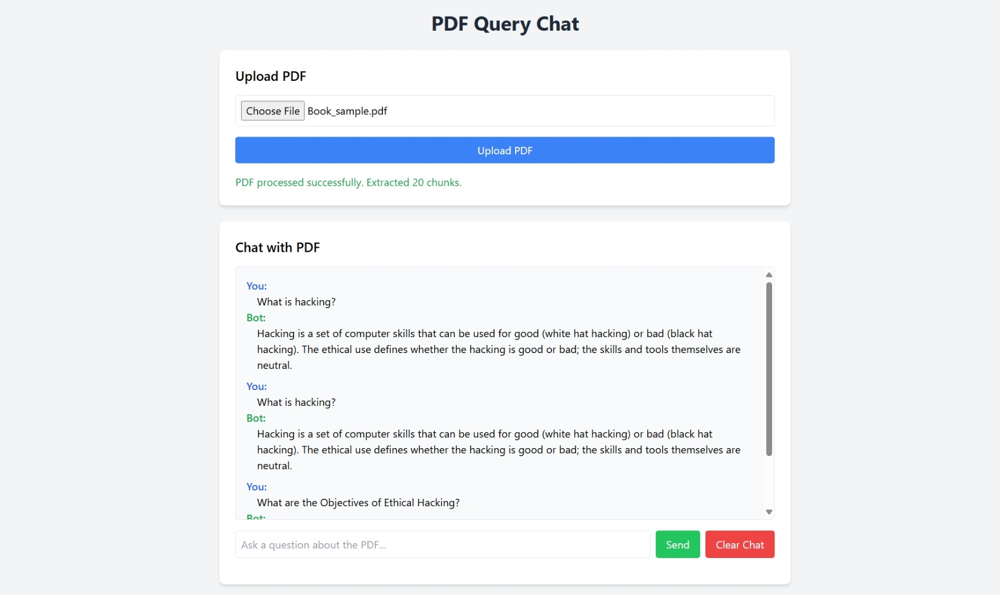

# PDF Query Chat Web Application

## Overview
The PDF Query Chat Web Application allows users to upload a PDF file, extract its text, process it into chunks, store the chunks in a vector database (ChromaDB), and query the content using a chat interface powered by the Gemini API. Built with Flask, `PyMuPDF`, `sentence-transformers`, and Tailwind CSS, the app provides a responsive UI for uploading PDFs and engaging in multiple chat interactions about the document's content.

## Workflow
1. **PDF Upload**:
   - Users upload a text-based PDF file via the web interface.
   - The backend validates the file (ensures it's a `.pdf`, under 16MB, and readable).
2. **Text Extraction and Chunking**:
   - `PyMuPDF` extracts text from the PDF.
   - Text is split into chunks (max 512 tokens, min 50 characters), respecting paragraph boundaries.
3. **Storage in ChromaDB**:
   - Chunks are embedded using the `all-MiniLM-L6-v2` model from `sentence-transformers`.
   - Embedded chunks are stored in a unique ChromaDB collection for the session.
4. **Chat Interaction**:
   - Users enter a query in the chat input.
   - The backend retrieves the top-3 relevant chunks from ChromaDB using cosine similarity.
   - The query and chunks are sent to the Gemini API (`gemini-1.5-flash`) for a concise answer.
   - Chat history (user queries and bot responses) is displayed and persists during the session.
5. **Multiple Chats**:
   - Users can ask multiple questions about the same PDF.
   - The "Clear Chat" button resets the chat history without affecting the stored chunks.
   - Uploading a new PDF starts a new session, clearing the previous collection and chat history.

## Prerequisites
- **Python**: 3.6 or higher (`python3 --version` to check).
- **Gemini API Key**: Obtain from [Google AI Studio](https://aistudio.google.com/app/apikey).
- **PDF**: A text-based PDF file for testing (scanned PDFs require OCR, not supported by default).

## Setup Instructions
1. **Clone or Create the Project Directory**:
   ```bash
   mkdir pdf_query_web
   cd pdf_query_web
   ```
   - Save `app.py` in the root directory.
   - Create a `templates` folder and save `index.html` inside it:
     ```bash
     mkdir templates
     ```

2. **Set Up a Virtual Environment**:
   ```bash
   python3 -m venv venv  # macOS/Linux
   python -m venv venv   # Windows
   ```
   - Activate it:
     - **macOS/Linux**:
       ```bash
       source venv/bin/activate
       ```
     - **Windows**:
       ```bash
       venv\Scripts\activate
       ```

3. **Install Dependencies**:
   ```bash
   pip install PyMuPDF chromadb sentence-transformers google-generativeai flask
   ```
   - Verify:
     ```bash
     pip show PyMuPDF chromadb sentence-transformers google-generativeai flask
     ```

4. **Configure the Gemini API Key**:
   - Set as an environment variable:
     - **macOS/Linux**:
       ```bash
       export GEMINI_API_KEY="your-api-key-here"
       ```
     - **Windows (Command Prompt)**:
       ```bash
       set GEMINI_API_KEY=your-api-key-here
       ```
     - **Windows (PowerShell)**:
       ```bash
       $env:GEMINI_API_KEY="your-api-key-here"
       ```
   - Alternatively, create a `.env` file:
     ```
     GEMINI_API_KEY=your-api-key-here
     ```
     Install `python-dotenv` (`pip install python-dotenv`) and add to `app.py`:
     ```python
     from dotenv import load_dotenv
     load_dotenv()
     ```
     Ensure `.env` is in `.gitignore`.

5. **Run the Application**:
   ```bash
   python app.py
   ```
   - Open `http://localhost:5000` in a browser.
   - The server runs in debug mode for development. For production, use a WSGI server (e.g., Gunicorn) and set `debug=False`.

## Usage
1. **Upload a PDF**:
   - Click "Choose File" and select a PDF (e.g., `sample.pdf`).
   - Click "Upload PDF."
   - A success message appears (e.g., "PDF processed successfully. Extracted X chunks.") or an error if the upload fails.
2. **Chat with the PDF**:
   - Enter a query in the chat input (e.g., "What is the main topic of the document?").
   - Click "Send" to get a response from the Gemini API based on relevant PDF chunks.
   - The chat history shows user queries and bot responses.
3. **Multiple Chats**:
   - Continue entering queries to ask more questions about the same PDF.
   - Click "Clear Chat" to reset the chat history.
4. **New PDF**:
   - Upload another PDF to start a new session, clearing the previous chat and collection.

## Screenshot
**Placeholder**:


## Troubleshooting
- **PDF Issues**: If "File must be a PDF" or "No text extracted," ensure the PDF is text-based. Scanned PDFs require OCR (contact developer for support).
- **Module Errors**: If `ModuleNotFoundError`, verify the virtual environment is active and dependencies are installed (`pip install PyMuPDF chromadb sentence-transformers google-generativeai flask`).
- **API Key**: If "Gemini API key not configured," check the environment variable (`echo $GEMINI_API_KEY` on macOS/Linux, `echo %GEMINI_API_KEY%` on Windows).
- **ChromaDB Errors**: Ensure write permissions for `./chroma_db`. Delete the folder to reset.
- **Gemini API Errors**: Verify API key validity and Google Cloud setup ([Gemini API Docs](https://ai.google.dev/gemini-api/docs)). Check quotas/rate limits.
- **Empty Response**: If "No relevant information found," ensure the PDF has extractable text and the query is relevant.
- **Flask Issues**: If `http://localhost:5000` doesn’t load, confirm the server is running and port 5000 is free. Try `http://127.0.0.1:5000`.

## Notes
- **PDF Requirement**: Must contain extractable text. Scanned PDFs are not supported without OCR.
- **ChromaDB Persistence**: Data is stored in `./chroma_db`. Delete the folder to reset.
- **Gemini Model**: Uses `gemini-1.5-flash`. Update `model_name` in `app.py` to `gemini-1.5-pro` for better performance (check pricing).
- **Enhancements**: Contact the developer for features like OCR, multiple PDF support, JSON output, or persistent collections.
- **Sample PDF**: Create a text-based PDF in a word processor or request a sample from the developer.